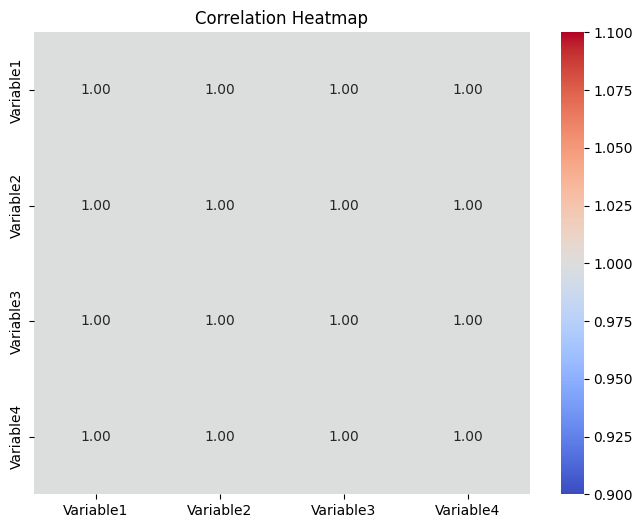

# Ex-2 Descriptive-Analytics
## AIM:
To calculate descriptive statistics, analyze data distribution, and measure relationships between variables using correlation and covariance, with visual representation through heatmaps.

## ALGORITHM:
1. Import required libraries (pandas, numpy, scipy.stats, matplotlib, seaborn) and load the dataset.
2. Calculate measures of central tendency (mean, median, mode) and dispersion (standard deviation, variance, range).
3. Analyze data distribution using skewness and kurtosis.
4. Compute covariance and correlation matrices to measure relationships between variables.
5. Visualize the correlation matrix using a heatmap for easy interpretation.
   
## PROGRAM AND OUTPUT:
### A.Using Summary Statistics to Calculating measures of central tendency and dispersion and Analyzing data distributions
Tools: Python (NumPy, Pandas)
```py
import numpy as np
import pandas as pd
from scipy.stats import mode, skew, kurtosis

# Example data
data = [12, 15, 14, 10, 10, 8, 12, 14, 15, 10, 18, 20, 25, 30, 15, 14]

# Convert data to a Pandas Series for convenience
data_series = pd.Series(data)

# Calculate measures of central tendency
mean_value = data_series.mean()
median_value = data_series.median()
mode_value = mode(data_series)[0][0]

# Calculate measures of dispersion
std_dev = data_series.std()
variance = data_series.var()
data_range = data_series.max() - data_series.min()

# Analyze distribution
data_skewness = skew(data_series)
data_kurtosis = kurtosis(data_series)

# Display results
print("Summary Statistics:")
print(f"Mean: {mean_value}")
print(f"Median: {median_value}")
print(f"Mode: {mode_value}")
print(f"Standard Deviation: {std_dev}")
print(f"Variance: {variance}")
print(f"Range: {data_range}")
print(f"Skewness: {data_skewness}")
print(f"Kurtosis: {data_kurtosis}")
```

### Output:
```
Summary Statistics:
Mean: 15.1875
Median: 14.5
Mode: 10
Standard Deviation: 6.156725278252877
Variance: 37.90625
Range: 22
Skewness: 0.9189293390832917
Kurtosis: 0.06474648980808049
```
### Explanation
1.Central Tendency:

Mean: Average of all values.

Median: Middle value when data is sorted.

Mode: Most frequently occurring value.

2.Dispersion:

Standard Deviation: Measure of the spread of data from the mean.

Variance: Square of the standard deviation.

Range: Difference between the maximum and minimum values.

3.Distribution Analysis:

Skewness: Indicates asymmetry. Positive skewness implies a tail on the right.

Kurtosis: Indicates whether data are heavy-tailed or light-tailed compared to a normal distribution.
### B. Correlation and Covariance to Measure relationships between variables and Visualize correlations using heat maps
Tools: Python/R
```py
import numpy as np
import pandas as pd
import seaborn as sns
import matplotlib.pyplot as plt

# Example dataset
data = {
    "Variable1": [10, 20, 30, 40, 50],
    "Variable2": [15, 25, 35, 45, 55],
    "Variable3": [12, 24, 36, 48, 60],
    "Variable4": [5, 10, 15, 20, 25],
}

# Convert to DataFrame
df = pd.DataFrame(data)

# Calculate Covariance
cov_matrix = df.cov()

# Calculate Correlation
corr_matrix = df.corr()

# Display Covariance and Correlation matrices
print("Covariance Matrix:")
print(cov_matrix)

print("\nCorrelation Matrix:")
print(corr_matrix)

# Visualize correlation using heatmap
plt.figure(figsize=(8, 6))
sns.heatmap(corr_matrix, annot=True, cmap="coolwarm", fmt=".2f")
plt.title("Correlation Heatmap")
plt.show()
```
### OUTPUT:
1. Covariance Matrix
```
The covariance matrix shows the extent to which variables vary together. 
                Variable1  Variable2  Variable3  Variable4
Variable1      250.0      250.0      300.0      125.0
Variable2      250.0      250.0      300.0      125.0
Variable3      300.0      300.0      360.0      150.0
Variable4      125.0      125.0      150.0       62.5
```
2. Correlation Matrix
```
The correlation matrix displays the strength of relationships between variables. Correlation values range from -1 to +1:
Correlation Matrix:
              Variable1  Variable2  Variable3  Variable4
Variable1      1.00       1.00       1.00       1.00
Variable2      1.00       1.00       1.00       1.00
Variable3      1.00       1.00       1.00       1.00
Variable4      1.00       1.00       1.00       1.00
```
3. Correlation Heatmap
A heatmap will be generated using Seaborn, visually representing the correlation matrix with a color gradient. Each cell's value will also be displayed on the heatmap.


### Explanation
1.Covariance:

Shows how two variables change together.

Positive values indicate they increase together; negative values indicate opposite directions.

2.Correlation:

Standardizes covariance to a range of -1 to +1.

Values close to 1/-1 indicate strong relationships, while values near 0 indicate weak or no relationships.

3.Heatmap Visualization:
A visual representation of the correlation matrix to make patterns easier to identify.

## RESULT: 
Descriptive statistics, data distribution, and relationships between variables were successfully analyzed. A heatmap effectively visualized the correlation matrix.


